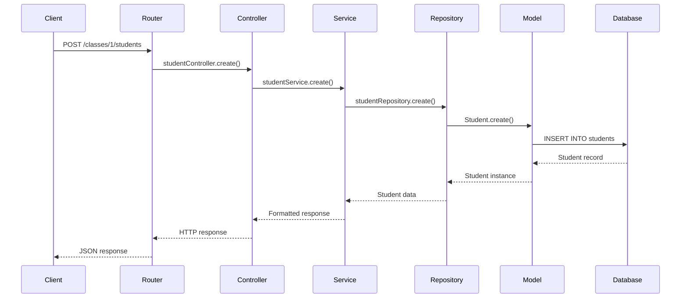
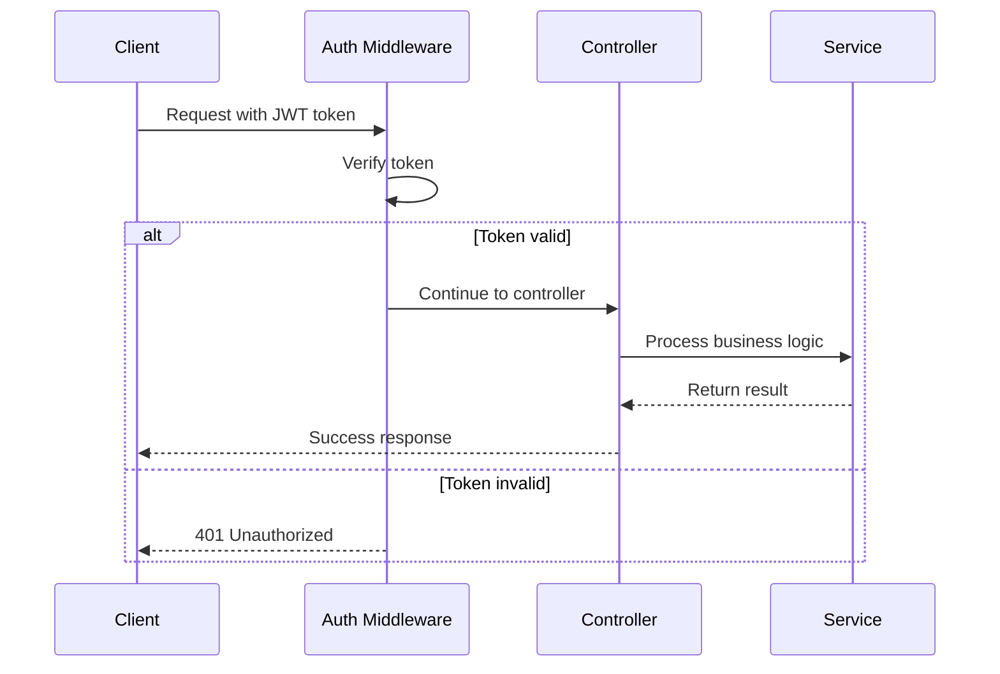

# 🏗️ Architecture Guide

## Table of Contents

- [Overview](#overview)
- [Architecture Pattern](#architecture-pattern)
- [System Components](#system-components)
- [Data Flow](#data-flow)
- [Layer Descriptions](#layer-descriptions)
- [Database Design](#database-design)
- [Security Architecture](#security-architecture)
- [File Upload Architecture](#file-upload-architecture)
- [API Design Patterns](#api-design-patterns)
- [Frontend Architecture](#frontend-architecture)
- [Deployment Architecture](#deployment-architecture)
- [Scalability Considerations](#scalability-considerations)

## Overview

The School Management System follows a **layered architecture pattern** with clear separation of concerns. This design promotes maintainability, testability, and scalability while ensuring code reusability and clean abstractions.

### Design Principles

- **Single Responsibility Principle**: Each layer has a specific responsibility
- **Dependency Inversion**: High-level modules don't depend on low-level modules
- **Separation of Concerns**: Business logic, data access, and presentation are separated
- **DRY (Don't Repeat Yourself)**: Common functionality is abstracted into reusable components
- **SOLID Principles**: Code follows SOLID design principles

### Architecture Benefits

- **Maintainability**: Easy to modify and extend
- **Testability**: Each layer can be tested independently
- **Scalability**: Components can be scaled independently
- **Reusability**: Business logic can be reused across different interfaces
- **Security**: Centralized security and validation logic

## Architecture Pattern

### Layered Architecture (4-Tier)

```
┌─────────────────────────────────────────────────────────┐
│                    Presentation Layer                   │
│                    (Controllers)                        │
├─────────────────────────────────────────────────────────┤
│                    Business Layer                       │
│                     (Services)                          │
├─────────────────────────────────────────────────────────┤
│                   Data Access Layer                     │
│                   (Repositories)                        │
├─────────────────────────────────────────────────────────┤
│                      Data Layer                         │
│               (Models & Database)                       │
└─────────────────────────────────────────────────────────┘
```

### Flow Direction

```
HTTP Request → Controller → Service → Repository → Model → Database
                    ↓           ↓          ↓         ↓
HTTP Response ← Controller ← Service ← Repository ← Model ← Database
```

## System Components

### Backend Components

```
backend/
├── server.js                 # Application entry point
├── src/
│   ├── config/              # Configuration files
│   │   └── database.js      # Database configuration
│   ├── controllers/         # HTTP request handlers
│   ├── services/            # Business logic layer
│   ├── repositories/        # Data access layer
│   ├── models/              # Database models
│   ├── routes/              # API route definitions
│   ├── middleware/          # Custom middleware
│   └── middlewares/         # Authentication middleware
├── uploads/                 # File upload storage
└── package.json             # Dependencies and scripts
```

### Frontend Components

```
frontend/
├── src/
│   ├── App.jsx              # Main application component
│   ├── main.jsx             # Application entry point
│   ├── Pages/               # Page components
│   ├── api/                 # API service classes
│   ├── assets/              # Static assets
│   └── styles/              # CSS and styling
├── public/                  # Public assets
└── package.json             # Dependencies and scripts
```

## Data Flow

### Request Flow (Create Student Example)



### Authentication Flow



## Layer Descriptions

### 1. Presentation Layer (Controllers)

**Purpose**: Handle HTTP requests and responses

**Responsibilities**:
- Request validation and sanitization
- HTTP status code management
- Response formatting
- Error handling
- File upload processing

**Example Structure**:
```javascript
// studentController.js
class StudentController {
  async create(req, res) {
    try {
      // Extract data from request
      const studentData = req.body;
      const photo = req.file;
      
      // Call service layer
      const result = await studentService.create(studentData, photo);
      
      // Return formatted response
      res.status(201).json({
        success: true,
        message: 'Student created successfully',
        data: result
      });
    } catch (error) {
      // Handle errors
      res.status(400).json({
        success: false,
        message: error.message
      });
    }
  }
}
```

### 2. Business Layer (Services)

**Purpose**: Implement business logic and rules

**Responsibilities**:
- Business rule validation
- Data transformation
- Complex business operations
- Cross-cutting concerns
- Integration between different repositories

**Example Structure**:
```javascript
// studentService.js
class StudentService {
  async create(studentData, photo) {
    // Business validation
    await this.validateStudentData(studentData);
    
    // Check for duplicate student number
    const existing = await studentRepository.findByStudentNumber(
      studentData.studentNumber
    );
    if (existing) {
      throw new Error('Student number already exists');
    }
    
    // Process photo upload
    if (photo) {
      studentData.photo = photo.path;
    }
    
    // Create student
    const student = await studentRepository.create(studentData);
    
    // Return formatted data
    return this.formatStudentResponse(student);
  }
}
```

### 3. Data Access Layer (Repositories)

**Purpose**: Manage data persistence and retrieval

**Responsibilities**:
- Database operations (CRUD)
- Query optimization
- Data mapping
- Transaction management
- Database-specific logic

**Example Structure**:
```javascript
// studentRepository.js
class StudentRepository {
  async create(studentData) {
    return await Student.create(studentData);
  }
  
  async findById(id) {
    return await Student.findByPk(id, {
      include: [{ model: Class, as: 'class' }]
    });
  }
  
  async findByStudentNumber(studentNumber) {
    return await Student.findOne({
      where: { studentNumber }
    });
  }
  
  async search(query) {
    return await Student.findAll({
      where: {
        studentName: {
          [Op.iLike]: `%${query}%`
        }
      },
      include: [{ model: Class, as: 'class' }]
    });
  }
}
```

### 4. Data Layer (Models)

**Purpose**: Define data structure and relationships

**Responsibilities**:
- Data model definitions
- Relationships and associations
- Validation rules
- Database constraints
- Hooks and lifecycle methods

**Example Structure**:
```javascript
// studentModel.js
const Student = sequelize.define('Student', {
  studentNumber: {
    type: DataTypes.STRING,
    allowNull: false,
    unique: true,
    validate: {
      notEmpty: true,
      len: [3, 20]
    }
  },
  studentName: {
    type: DataTypes.STRING,
    allowNull: false,
    validate: {
      notEmpty: true,
      len: [2, 100]
    }
  },
  // ... other fields
}, {
  hooks: {
    beforeCreate: (student) => {
      student.status = 'active';
    }
  }
});

// Associations
Student.belongsTo(Class, { foreignKey: 'classId', as: 'class' });
```

## Database Design

### Entity Relationship Diagram

```
┌─────────────┐       ┌─────────────┐       ┌─────────────┐
│    User     │       │   School    │       │   Class     │
├─────────────┤       ├─────────────┤       ├─────────────┤
│ id (PK)     │◄──────┤ userId (FK) │       │ id (PK)     │
│ name        │       │ name        │       │ className   │
│ email       │       │ type        │       │ year        │
│ password    │       │ regNumber   │       │ capacity    │
│ school      │       │ location    │       │ schoolId(FK)│◄─┐
│ institute   │       │ phone       │       │ status      │  │
└─────────────┘       │ email       │       └─────────────┘  │
                      │ website     │              │          │
                      │ photo       │              │          │
                      │ headMaster  │              │          │
                      └─────────────┘              │          │
                                                   │          │
                                          ┌─────────────┐     │
                                          │   Student   │     │
                                          ├─────────────┤     │
                                          │ id (PK)     │     │
                                          │ studentNum  │     │
                                          │ studentName │     │
                                          │ dob         │     │
                                          │ age         │     │
                                          │ fatherName  │     │
                                          │ motherName  │     │
                                          │ photo       │     │
                                          │ address     │     │
                                          │ phone       │     │
                                          │ email       │     │
                                          │ classId(FK) │─────┘
                                          │ status      │
                                          └─────────────┘
```

### Database Relationships

1. **User → School**: One-to-One relationship
2. **School → Class**: One-to-Many relationship
3. **Class → Student**: One-to-Many relationship

### Constraints and Indexes

```sql
-- Primary Keys
ALTER TABLE users ADD CONSTRAINT pk_users PRIMARY KEY (id);
ALTER TABLE schools ADD CONSTRAINT pk_schools PRIMARY KEY (id);
ALTER TABLE classes ADD CONSTRAINT pk_classes PRIMARY KEY (id);
ALTER TABLE students ADD CONSTRAINT pk_students PRIMARY KEY (id);

-- Foreign Keys
ALTER TABLE schools ADD CONSTRAINT fk_schools_users 
  FOREIGN KEY (userId) REFERENCES users(id);
ALTER TABLE classes ADD CONSTRAINT fk_classes_schools 
  FOREIGN KEY (schoolId) REFERENCES schools(id);
ALTER TABLE students ADD CONSTRAINT fk_students_classes 
  FOREIGN KEY (classId) REFERENCES classes(id);

-- Unique Constraints
ALTER TABLE users ADD CONSTRAINT uk_users_email UNIQUE (email);
ALTER TABLE students ADD CONSTRAINT uk_students_number UNIQUE (studentNumber);

-- Indexes
CREATE INDEX idx_students_name ON students(studentName);
CREATE INDEX idx_classes_year ON classes(year);
CREATE INDEX idx_students_status ON students(status);
```

## Security Architecture

### Authentication & Authorization

```
┌─────────────┐    ┌─────────────┐    ┌─────────────┐
│   Client    │    │   Server    │    │  Database   │
│             │    │             │    │             │
│ 1. Login    │───►│ 2. Verify   │───►│ 3. Check    │
│    Request  │    │    Creds    │    │    User     │
│             │    │             │    │             │
│ 5. Store    │◄───│ 4. Generate │◄───│             │
│    Token    │    │    JWT      │    │             │
│             │    │             │    │             │
│ 6. API      │───►│ 7. Verify   │    │             │
│    Request  │    │    JWT      │    │             │
│    + Token  │    │             │    │             │
└─────────────┘    └─────────────┘    └─────────────┘
```

### Security Layers

1. **Input Validation**: Server-side validation for all inputs
2. **Authentication**: JWT token-based authentication
3. **Authorization**: Role-based access control
4. **Data Encryption**: Passwords hashed with bcrypt
5. **CORS Protection**: Configured for specific origins
6. **File Upload Security**: Type and size validation
7. **SQL Injection Protection**: Sequelize ORM parameterized queries

### Security Middleware Stack

```javascript
// Security middleware order
app.use(helmet());           // Security headers
app.use(cors(corsOptions));  // CORS protection
app.use(rateLimiter);        // Rate limiting
app.use(authMiddleware);     // Authentication
app.use(validator);          // Input validation
```

## File Upload Architecture

### Upload Flow

```
Client Upload → Multer Middleware → Validation → Storage → Database
     ↓              ↓                   ↓           ↓         ↓
   File          File Type           File Size    File       File Path
  Selection      Validation          Check        Storage    in DB
```

### Storage Structure

```
uploads/
├── schools/          # School photos
│   ├── school-{timestamp}-{random}.{ext}
├── classes/          # Class photos
│   ├── class-{timestamp}-{random}.{ext}
└── students/         # Student photos
    ├── student-{timestamp}-{random}.{ext}
```

### File Validation

```javascript
const multerConfig = {
  storage: multer.diskStorage({
    destination: (req, file, cb) => {
      const uploadPath = path.join('uploads', req.uploadType);
      cb(null, uploadPath);
    },
    filename: (req, file, cb) => {
      const uniqueName = `${req.uploadType}-${Date.now()}-${Math.round(Math.random() * 1E9)}`;
      cb(null, uniqueName + path.extname(file.originalname));
    }
  }),
  fileFilter: (req, file, cb) => {
    // Allow only image files
    if (file.mimetype.startsWith('image/')) {
      cb(null, true);
    } else {
      cb(new Error('Only image files are allowed'), false);
    }
  },
  limits: {
    fileSize: 5 * 1024 * 1024 // 5MB limit
  }
};
```

## API Design Patterns

### RESTful API Design

| Method | Endpoint | Description |
|--------|----------|-------------|
| GET | `/schools` | Get school data |
| POST | `/schools` | Create school |
| PUT | `/schools` | Update school |
| GET | `/classes` | List classes |
| POST | `/classes` | Create class |
| GET | `/classes/:id` | Get specific class |
| PUT | `/classes/:id` | Update class |
| DELETE | `/classes/:id` | Delete class |
| POST | `/classes/:id/students` | Add student to class |

### Response Patterns

```javascript
// Success Response Pattern
{
  success: true,
  message: "Operation completed successfully",
  data: { /* response data */ }
}

// Error Response Pattern
{
  success: false,
  message: "Error description",
  code: "ERROR_CODE",
  errors: { /* field-specific errors */ }
}

// Pagination Response Pattern
{
  success: true,
  data: {
    items: [ /* data array */ ],
    pagination: {
      page: 1,
      limit: 10,
      total: 100,
      totalPages: 10
    }
  }
}
```

## Frontend Architecture

### Component Structure

```
src/
├── App.jsx                  # Main app component
├── main.jsx                 # Entry point
├── Pages/                   # Page components
│   ├── dashboard.jsx        # Dashboard page
│   ├── login.jsx           # Login page
│   ├── school.jsx          # School management
│   └── student.jsx         # Student management
├── api/                     # API service layer
│   ├── loginService.js      # Authentication API
│   ├── schoolService.js     # School API
│   └── studentService.js    # Student API
└── assets/                  # Static assets
```

### State Management

```javascript
// Service-based state management
class SchoolService {
  constructor() {
    this.baseURL = 'http://localhost:6001/api';
    this.token = localStorage.getItem('token');
  }
  
  async makeRequest(endpoint, options = {}) {
    const url = `${this.baseURL}${endpoint}`;
    const config = {
      headers: {
        'Authorization': `Bearer ${this.token}`,
        ...options.headers
      },
      ...options
    };
    
    return fetch(url, config);
  }
}
```

### Component Communication

```
┌─────────────┐    ┌─────────────┐    ┌─────────────┐
│    Page     │    │   Service   │    │   Backend   │
│ Component   │    │   Layer     │    │    API      │
│             │───►│             │───►│             │
│ (UI Logic)  │    │ (API Calls) │    │ (Business)  │
│             │◄───│             │◄───│             │
└─────────────┘    └─────────────┘    └─────────────┘
```

## Deployment Architecture

### Development Environment

```
┌─────────────┐    ┌─────────────┐    ┌─────────────┐
│  Frontend   │    │   Backend   │    │  Database   │
│             │    │             │    │             │
│ React Dev   │───►│ Node.js     │───►│   SQLite    │
│ Server      │    │ Express     │    │   Local     │
│ (Vite)      │    │ (Nodemon)   │    │   File      │
│             │    │             │    │             │
│ Port: 5173  │    │ Port: 6001  │    │ school.db   │
└─────────────┘    └─────────────┘    └─────────────┘
```

### Production Environment

```
┌─────────────┐    ┌─────────────┐    ┌─────────────┐
│   Nginx     │    │   Node.js   │    │ PostgreSQL  │
│ (Reverse    │    │  Cluster    │    │ / MySQL     │
│  Proxy)     │───►│             │───►│             │
│             │    │ PM2 Process │    │ Production  │
│ Port: 80/443│    │ Manager     │    │ Database    │
└─────────────┘    └─────────────┘    └─────────────┘
```

## Scalability Considerations

### Horizontal Scaling

1. **Load Balancing**: Multiple backend instances
2. **Database Clustering**: Read replicas for queries
3. **CDN**: Static assets and file uploads
4. **Caching**: Redis for session and data caching

### Vertical Scaling

1. **Database Optimization**: Indexes and query optimization
2. **Memory Management**: Efficient memory usage
3. **CPU Optimization**: Asynchronous operations
4. **Storage**: SSD for database and file storage

### Microservices Migration Path

```
Current Monolith:
┌─────────────────────────────────┐
│         School System           │
│ ┌─────┐ ┌─────┐ ┌─────┐ ┌─────┐ │
│ │Auth │ │School│ │Class│ │Student│ │
│ └─────┘ └─────┘ └─────┘ └─────┘ │
└─────────────────────────────────┘

Future Microservices:
┌─────────┐ ┌─────────┐ ┌─────────┐ ┌─────────┐
│  Auth   │ │ School  │ │  Class  │ │ Student │
│ Service │ │ Service │ │ Service │ │ Service │
└─────────┘ └─────────┘ └─────────┘ └─────────┘
```

### Performance Optimization

1. **Database Indexing**: Key fields indexed
2. **Query Optimization**: Efficient Sequelize queries
3. **File Upload**: Streaming for large files
4. **Response Compression**: Gzip compression
5. **API Caching**: Cache frequently accessed data

---

*This architecture guide provides a comprehensive overview of the system design. For implementation details, refer to the source code and API documentation.*
